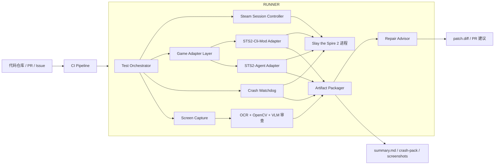
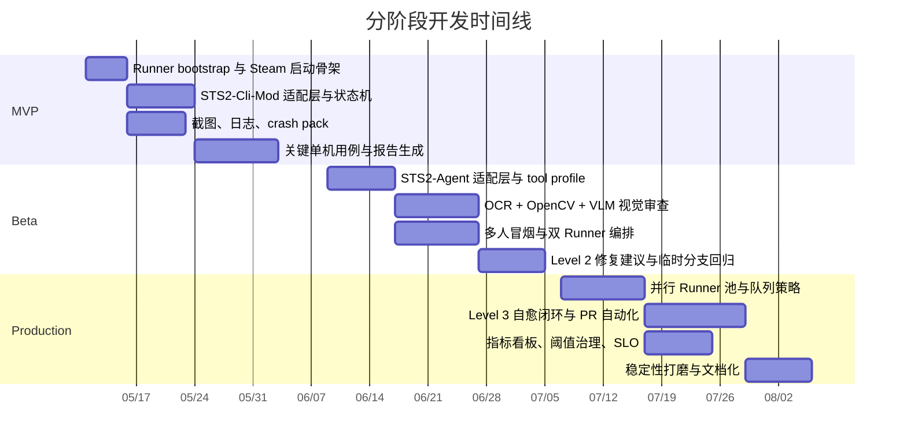

# 杀戮尖塔 2 Mod 端到端自动化测试系统设计与分阶段开发计划

## Executive Summary

面向工程实施的结论只有一句话：**不要试图用单一个项目吃掉“启动 Steam → 启动游戏 → 进入菜单 → 跑完整局内测试 → 发现崩溃 → 取日志与截图 → 给出修复建议 → 重启回归”这条链路。**现有生态已经把“游戏进程内的语义控制”做得很强，但 Steam 启动、首次登录与 Steam Guard、首次 mod warning、任意 mod 设置页、桌面截图、渲染缺陷识别、进程崩溃后的恢复，仍然必须由游戏外层的 Orchestrator、桌面自动化和证据采集层接手。`STS2-Cli-Mod` 已经把大量单机流程做成了 Named Pipe + JSON CLI，覆盖 40+ 命令和 16+ 屏幕类型；`STS2-Agent` 则提供了本地 HTTP API + MCP Server、tool profile、`available_actions` 约束、SSE 等待工具、游戏元数据查询，以及公开声明为 release-ready 的多人主循环支持。二者都要在游戏加载 mod 之后才能工作，因此 entity["company","Valve","steam platform"] 的 Steam 启动与通用桌面交互必须放到外层。citeturn3view2turn3view3turn6view0turn7view0turn21view3turn9search0turn9search3

本方案建议采用四层混合架构：**桌面控制层、游戏语义控制层、证据与可观测性层、AI 分析与修复层**。其中，桌面控制层负责 Steam/Game 进程和 Computer Use；游戏语义控制层通过 `STS2-Cli-Mod` 与 `STS2-Agent` 适配器执行局内动作；证据层负责状态、日志、截图、视频与 crash pack；AI 层负责 OCR/VLM 视觉审查、失败归因和修复建议。这样做的关键价值不是“多堆几个工具”，而是把**可确定的事情交给确定性脚本，把需要看屏幕的事情交给视觉，把需要推理的事情交给 agent**。citeturn3view2turn4view0turn5view3turn6view0turn16view7

工程落地上，**MVP 应以 `STS2-Cli-Mod` 为主控制底座**，原因是它的 CLI 对 CI 更天然，命令输出统一是 JSON，使用稳定 ID 而非脆弱索引，还内置本地 `report_bug` 命令，适合做脚本化回归、工单化归档与重启重跑。**Beta 再引入 `STS2-Agent` 作为 MCP-native 适配层**，用于多人冒烟、AI 规划/战斗分层、等待事件、元数据增强和 agent handoff。到了 Production，再把 OCR/VLM、视觉回归、Level 2/3 自动修复和并行 Runner 池补齐。citeturn4view0turn12view0turn5view3turn14view3turn7view0

CI/CD 方面，**GitHub-hosted / Microsoft-hosted 适合构建、单元测试、包产物与静态检查，但不适合作为主力可视化 E2E 环境**。entity["company","GitHub","developer platform"] 官方文档说明 GitHub-hosted runner 本质上是托管 VM，虽然 larger runner 提供 Windows、GPU 与自定义镜像，但其本质仍是托管虚机；entity["company","Microsoft","cloud devops"] 的 Azure Pipelines 官方文档更明确指出，**visible UI testing 不支持 Microsoft-hosted agents**，桌面应用或非 headless UI 测试必须使用自托管 Windows agent，并以 interactive process + autologon 方式运行。对 Steam 游戏而言，这个限制几乎直接等价为：**全链路 E2E 必须跑在自建 Windows runner 上**。citeturn16view0turn16view6turn16view3turn16view4

自动化边界也需要说清楚：在一次性人工完成 Steam 登录、Steam Guard、游戏安装、图形设置、首次 mod warning 确认后，后续测试轮次可以做到高度无人值守；但**Steam Guard、首次账号认证、涉及潜在风险的 Computer Use 操作审批、以及自动修复补丁合并到主分支**，不建议完全无人化。Steam 官方帮助页明确表明，Steam Guard 是账号保护的重要组成部分，且同一台电脑同一时间只能访问一个 Steam 账户；同时，受限账户不能主动发送好友邀请，这会直接影响多人联机测试账号策略。citeturn20search0turn20search2turn20search5turn20search18turn20search9turn20search1

## 研究结论与技术选型

从公开仓库和官方文档看，现有生态可以分成四类：第一类是**游戏内控制桥**，包括 `STS2-Cli-Mod`、`STS2-Agent` 与其上游 `STS2MCP`；第二类是**agent 外壳与护栏**，如 `STS2-Agent` 的 MCP profile 与等待工具、以及基于 `STS2MCP` 的本地 agent 示例；第三类是**快速逻辑回归/模拟层**，例如 `wuhao21/sts2-cli` 这种在终端中 headless 运行真实游戏引擎的项目；第四类是**代码生成/构建辅助层**，如 `AgentTheSpire`，更偏 mod 代码和美术生成，而不是运行时测试控制。对你的目标而言，真正决定成败的是第一、二类；第三类应作为补充测试金字塔的下层；第四类只应作为修复建议或样板代码来源。citeturn2view1turn2view3turn2view5turn2view4

特别值得强调的是，`STS2-Agent` 与上游 `STS2MCP` 已经把多人/大厅/主菜单控制做得相当深入。上游 `STS2MCP` README 明确写到支持 singleplayer、multiplayer（co-op）、profile switching、character select、multiplayer host / Steam-friend join / FastMP localhost join 等流程；而 `CharTyr/STS2-Agent` 的 v0.7.0 release note 则进一步宣称“**Multiplayer AI control is now release-ready for the main play loop**”，并补充了 map vote、多人休息点 `MEND` target handling、多人验证脚本等能力。与此相对，`STS2-Cli-Mod` 的公开 CLI 参考覆盖了单机主菜单、角色选择、地图、战斗、事件、休息点、商店、奖励、Bundle、Crystal Sphere 与 Game Over，但其公开文档里**没有列出多人大厅或联机命令**，因此工程上必须把它视为“单机优先、多人待扩展”的底座，而不能把多人能力当成已公开可用。citeturn2view3turn6view8turn7view0turn10view5turn10view6turn11view1turn11view2turn11view4turn13view0turn11view7

另一个研究结论是：**mod 设置页和任意动态 UI 不是现成语义 API 的强项。**`STS2-Cli-Mod` 的公开 screen/model 集合里没有 Settings/Mods 泛化接口；`STS2-Agent` 的 tool surface 则聚焦于 `get_game_state`、`get_available_actions`、`act` 以及战斗/房间/奖励类动作，也没有把 arbitrary mod settings 作为通用可编排对象开放。因此，工程上应把“进入设置、切换 Mods 标签、定位某个反射生成的开关/滑条/下拉框、做改动并截图确认”统一定义为**桌面层能力**，由 Computer Use 或自研桌面自动化模块完成。官方 Computer Use 文档明确就是为“**没有 API 的桌面和 Web UI**”而设计的 screenshot → action → screenshot 循环。citeturn12view0turn14view1turn21view3turn16view7

最后，建议把测试体系做成**四层测试金字塔**：L0 做代码静态检查与单元测试；L1 用 headless 引擎或纯逻辑模拟做快速回归；L2 用 `STS2-Cli-Mod`/`STS2-Agent` 在真实游戏进程里做语义 E2E；L3 再上屏幕截图、OCR、VLM 和 Computer Use 做视觉与桌面流程验证。`wuhao21/sts2-cli` 的价值正是在 L1，它声称在终端里跑真实游戏引擎，伤害、卡牌效果、敌人 AI、遗物和 RNG 与实际游戏一致；但因为它绕过了真正的 Steam、窗口系统和渲染路径，所以不能替代你的目标 E2E。citeturn2view5turn16view3

### 自动化边界矩阵

| 环节                            | 主控方式                          | 自动化等级 |   是否建议人工兜底 |
| ----------------------------- | ----------------------------- | ----: | ---------: |
| Steam 已登录前的账号认证 / Steam Guard | 人工一次性 bootstrap               | 部分自动化 |          是 |
| 启动 Steam / 启动游戏 / 重启游戏        | 桌面控制层 + Steam URI / OS 进程控制   |     高 |          否 |
| 首次 mod warning / 首次启用 Mod     | Computer Use                  |     高 |   建议首次人工确认 |
| 主菜单进入单机流程                     | `STS2-Cli-Mod` 或 `STS2-Agent` |     高 |          否 |
| 多人大厅、投票、联机主循环                 | `STS2-Agent` 优先               |   中到高 |   建议保留人工回退 |
| mod 设置页                       | Computer Use + 截图确认           |   中到高 |          否 |
| 战斗 / 商店 / 事件 / 休息点            | 语义控制层                         |     高 |          否 |
| 崩溃检测 / 日志打包 / 自动重启            | 外层 Watchdog                   |     高 |          否 |
| 视觉缺陷审查                        | 截图 + OCR + VLM                |   中到高 | 关键缺陷建议人工复核 |
| 自动修复补丁合并到主干                   | Level 3 仅限隔离分支                |   低到中 |          是 |

表中结论来自：`STS2-Cli-Mod` 的 CLI 参考与 README、`STS2-Agent`/`STS2MCP` 的 README 与 release note、以及官方 Computer Use / Steam 帮助文档。citeturn3view2turn3view3turn4view0turn12view0turn14view1turn7view0turn2view3turn21view3turn20search0turn20search18

### STS2-Cli-Mod 与 STS2-Agent 能力比较

| 维度 | STS2-Cli-Mod | STS2-Agent | 工程建议 |
|---|---|---|---|
| 外部接口 | 本地 CLI，可脚本化调用；Named Pipe + JSON | 本地 HTTP API + MCP Server | 两者都封成统一 Adapter |
| 状态与动作 | 40+ 命令、16+ screen、稳定 ID、统一 exit code | `health_check`、`get_game_state`、`get_available_actions`、`act`、等待工具、元数据工具 | CLI 适合 deterministic regression；MCP 适合 AI-first |
| 单机主流程 | 公开文档覆盖完整 | 覆盖完整 | MVP 两者都可 |
| 多人 / 大厅 / 投票 | 公开文档未见明确支持 | 文档和 release note 明确支持，并有 v0.7.0 多人强化 | Beta/Prod 用 STS2-Agent |
| Tool 约束与误调用护栏 | 以 CLI 参数和状态控制为主 | `guided / layered / full`、`available_actions`、高层动作、等待/hand-off | 面向 agent 时更推荐 STS2-Agent |
| 元数据与知识增强 | 以状态 JSON 为主 | 支持 live game metadata、知识目录、planner/combat handoff | 做 AI 规划/解释时优先 STS2-Agent |
| 崩溃信息归档 | 本地 `report_bug` 很实用 | 需外层自己打包 | CLI-Mod 适合接入工单化 |
| 动态 mod settings | 无通用支持 | 无通用支持 | 统一交给 Computer Use |
| 视觉检查 | 无 | 无 | 两者都需要外层截图/OCR/VLM |
| 许可证 / 合规 | 公开页面截取中未明确 surfaced LICENSE，需人工复核 | AGPL-3.0-only | 引入前先做许可评估 |

表格判断分别基于 `STS2-Cli-Mod` 的 Named Pipe/JSON/命令文档、`report_bug` 本地指令、`STS2-Agent` 的 tool profile、health/MCP/startup 文档、live metadata 与 v0.7.0 多人发布说明。关于 `STS2-Cli-Mod` 许可证，本文只做“公开页面未清晰 surfaced”的风险提示，不做法律结论。citeturn3view2turn3view3turn4view0turn12view0turn5view3turn14view1turn14view3turn15view0turn7view0turn23view0turn23view1

**最终技术选型建议**：MVP 用 `STS2-Cli-Mod` 打底，拿到确定性回归、日志工单与最小闭环；Beta 加 `STS2-Agent`，把 MCP-native agent、多人、等待工具和 metadata 能力并入；Production 保持“双适配器并存”，让 Orchestrator 能按测试类型自动选择驱动。这样既不会被单一仓库的演进节奏绑死，也能在游戏版本升级时有回退路径。citeturn3view3turn12view0turn14view3turn7view0

## 端到端架构设计

本系统建议采用“**Runner 内闭环、Runner 外只做调度**”的架构：代码仓库、CI 触发器、工单系统和制品系统都在外层；真正对 Steam、窗口、截图和游戏语义动作的操作，都集中在一台**自托管 Windows 交互式 Runner**内完成。这样可以避免把鼠标键盘、Steam 会话和游戏进程拆散到多个不可靠的节点上，也最符合 Azure 对 visible UI agent 的要求。citeturn16view3turn16view4turn16view1



### 控制平面划分

**桌面控制平面**负责 Steam 启动、窗口聚焦、Alt+F4、截图、模组设置页和任何没有现成游戏 API 的东西；**游戏语义控制平面**负责“开始新局、选角色、选路径、出牌、买卖、事件、休息点”等游戏内原子动作；**观测与证据平面**负责健康检查、日志拉取、状态快照、截图/视频、失败归档；**AI 分析平面**负责视觉缺陷审查、失败归因、修复建议与 rerun 决策。`STS2-Agent` 适合作为“AI 面向工具层”，因为它有 `guided / layered / full` 三个 profile、`available_actions` 约束和高层操作；`STS2-Cli-Mod` 更像“脚本回归执行层”，因为它天然是 CLI + JSON，并且用稳定 ID 来减少索引漂移问题。citeturn5view3turn14view3turn4view0

### 统一适配器接口

Orchestrator 不应直接把业务逻辑绑在某一个三方仓库上，而应定义统一接口，例如：

- `health_check()`
- `get_state()`
- `get_available_actions()`
- `act(action, args)`
- `wait_until_actionable()`
- `capture_bug_snapshot()`
- `supports_multiplayer()`
- `supports_metadata()`
- `supports_debug_actions()`

`CliModAdapter` 的实现方式是启动 `sts2` 子进程并解析 stdout JSON；`AgentAdapter` 的实现方式是直连 Mod HTTP API 或通过 MCP server 调用 `get_game_state`、`get_available_actions`、`act`、`wait_for_event`、`wait_until_actionable`。**Production 默认 profile 建议用 `guided`；只有在需要主/副 agent 分层或兼容性回归时才启用 `layered` / `full`。**citeturn4view0turn5view3turn14view1turn15view0

### 启动与重启策略

启动策略按优先级分三层：**第一层**使用 Steam URI 或 Steam 命令行（例如 `steam://run/<AppID>` 或 `steam.exe -applaunch <AppID>`）启动；**第二层**用进程探测确认 Steam 与游戏进程是否存活；**第三层**在 mod health 未 ready 时切换到 Computer Use，处理首次 mod warning、进入 Settings→Mods、勾选 mod 或清理阻塞弹窗。重启策略也分层：游戏崩溃但 Steam 正常时，只重启游戏；Steam 自身卡死、登录异常或下载校验异常时，重启 Steam + 游戏；为防止长时间运行导致资源泄漏，建议每 N 轮用例或每次检测到显存/内存异常波动时做一次 full recycle。citeturn9search0turn9search3turn6view0turn15view0turn21view3

## 模块清单与详细规范

下表给出实施时的最小模块集。这里的“优先级”针对开发顺序，而不是运行时重要性；P0 表示 MVP 必须完成，P1 表示 Beta 必须完成，P2 表示 Production 完善项。

| 模块 | 核心职责 | 输入 | 输出 | 主要依赖 | 优先级 | 主要风险 | 缓解措施 |
|---|---|---|---|---|---|---|---|
| Test Orchestrator | 统一调度测试会话、状态机、重试与重启 | 用例 DSL、构建产物、环境变量 | 测试执行结果、控制指令 | Python 3.11、PowerShell、Runner | P0 | 业务逻辑散落在脚本中 | 采用明确状态机与 Adapter 接口 |
| Steam Session Controller | 启动 Steam、启动游戏、检测会话、处理重启策略 | AppID、Steam 路径、Runner 凭据状态 | Steam Ready / Game Ready / Restart Result | Steam 客户端、OS 进程 API、Computer Use | P0 | Steam Guard / 首次登录 / 弹窗阻塞 | 一次性人工 bootstrap；弹窗走 Computer Use |
| CliModAdapter | 对接 `STS2-Cli-Mod`，执行 CLI 命令并解析 JSON | `sts2` 命令、超时、运行态 | 状态 JSON、动作响应、`report_bug` 文件 | `STS2-Cli-Mod` 发布包 | P0 | 命令层与测试 DSL 强耦合 | 用中间动作模型解耦 |
| AgentAdapter | 对接 `STS2-Agent` 的 HTTP / MCP | base URL、tool profile、MCP client | health、state、available actions、act 响应 | `STS2-Agent`、`uv`、Python | P1 | MCP profile 误用或 debug actions 泄漏 | 默认 guided，debug 默认为关 |
| Planner & Policy Engine | 负责选驱动、动作白名单、seed、路径与重试策略 | 当前 state、suite policy、历史失败 | 下一步动作、回退决策 | Adapter、测试 DSL | P0 | 小模型误调用 | 动作前强制读 state + legal action |
| Screen Capture Service | 抓窗口图、全屏图、ROI 图、失败前后帧 | Capture point、窗口句柄 | PNG、可选 MP4 | Windows capture API / ffmpeg / mss | P0 | 黑屏、最小化、焦点丢失 | 测试前强制窗口前置与分辨率固定 |
| Visual QA Engine | OCR、模板匹配、ROI 比对、VLM 语义审查 | 截图、期望值、游戏元数据 | visual pass/fail、缺陷标签 | Tesseract / PaddleOCR / OpenCV / VLM | P1 | 误报/漏报 | “状态断言 + OCR + VLM” 三重校验 |
| Crash Watchdog | 监控进程、API 存活、窗口冻结、超时 | 心跳、进程信息、截图 hash | crash/freeze 分类、恢复动作 | Adapter、OS API | P0 | 假死与正常等待难区分 | screen/actionability 双阈值 |
| Log Collector | 采集 Godot 日志、mod 日志、runner 日志 | 路径配置、run_id | log bundle | Godot user://、mods/logs、_diag | P0 | 路径漂移 | 配置 + 自动扫描双模式 |
| Artifact Packager | 归档 screenshots、states、actions、logs、summary | 所有产物路径 | crash pack / zip / markdown report | 文件系统、CI artifact store | P0 | 产物过大 | 只保留关键帧与失败视频 |
| Repair Advisor | 分析 crash pack，给出根因、补丁、重跑建议 | logs、stack、源码、测试结果 | issue 文本、patch.diff、rerun request | LLM / 静态分析 / repo checkout | P1 | 幻觉修复 | Level 1→2→3 分级推进 |
| Runner Manager | 管理自托管 runner、标签、并发、队列 | pipeline 标签、环境清单 | 调度结果、Runner 健康 | GitHub/Azure runner | P1 | 冲突占用 Steam 会话 | 一机一 agent，一机会话隔离 |
| Metrics & Dashboard | 统计用例趋势、崩溃率、视觉失败率、MTTR | summary.json、历史 runs | 看板、告警 | 时序库/SQLite/ELK | P2 | 过早复杂化 | 先从 JSONL + 简单 dashboard 开始 |

### 语义控制模块的职责边界

`STS2-Cli-Mod` 在实现上是“AI Agent → CLI → Named Pipe → In-Game Mod → Game”的链路，两个 .NET 9 / C# 项目通过 `sts2-cli-mod` 这个命名管道传 JSON，mod 侧在 Godot 4.5.1 主线程上抽取状态并执行动作；而 `STS2-Agent` 则是“游戏 Mod 暴露 HTTP API，再由 `mcp_server` 包成 MCP”。这意味着两者在职责上天然不同：前者更适合做**测试执行内核**，后者更适合做**AI 工具层与 agent runtime**。citeturn3view2turn3view3turn2view1turn5view3

### 视觉与桌面层的职责边界

桌面层要坚持一个工程原则：**只把游戏内语义层做不到的事情下沉到桌面自动化。**因此，卡牌购买、休息点升级、事件选项、奖励收取、地图选点都应优先用语义动作；只有 Steam 启动、通用 mod settings、原生/第三方弹窗、窗口异常和截图取证才走桌面层。这样可以把脆弱的像素点击比例压到最低，同时保留对“没有 API 的 UI”的兜底能力。citeturn4view0turn14view3turn21view3

### 观测层的最小成功标准

一个测试系统不是“能点几下游戏”就算完成；它至少要满足四个工程属性：**可重跑、可诊断、可归档、可恢复**。因此，MVP 的最低标准不是“会玩一局”，而是“会在失败时留下足够证据，并能自动起下一局”。`STS2-Cli-Mod` 的 `report_bug` 本地命令可以直接成为 crash pack 的一个子工件；`STS2-Agent` 的 `health` / `healthz`、`wait_until_actionable` 和 release 中的验证脚本，则适合接成更完整的健康检查链。citeturn12view0turn6view0turn15view0turn7view0

## 自动化测试工作流

### 启动、心跳与恢复策略

推荐的执行策略不是“agent 连续自由发挥”，而是**状态先行、动作后置、动作后重读状态**。这与 `STS2-Agent` 自己在 MCP 文档里给出的建议一致：会话开始先 `health_check`，每次决策前都 `get_game_state`，只调用 `available_actions` 里的动作，动作之后重新读取状态，不复用旧索引，并优先使用高层动作如 `collect_rewards_and_proceed`、`choose_rest_option`、`confirm_modal` 等。即使在没有 MCP 的 `STS2-Cli-Mod` 路径下，也应遵循同样的状态机哲学。citeturn14view3turn5view10

建议的健康检查阈值如下：

| 层级 | 检查方式 | 阈值 | 判定 | 处置 |
|---|---|---:|---|---|
| Steam | 进程存在、窗口存在 | 每 2s | 不存在 | 启动 Steam |
| Game 进程 | 进程存在、窗口响应 | 每 2s | 进程消失 | crash |
| Mod / CLI | `/health` 或 `sts2 ping/state` | 2s 超时，连续 3 次 | suspect freeze | 采样截图与日志 |
| Actionable | `wait_until_actionable` 或 state 刷新 | 30s | 卡住 | freeze |
| 屏幕活性 | 截图 hash/ROI 差分 | 30s 连续不变 | UI stuck | 归档并重启 |
| Runner | runner 服务 + 磁盘空间 | 每轮用例前 | 不健康 | 终止当前批次 |

恢复策略建议分三步：第一次失败只重启游戏；同一用例连续两次失败后重启 Steam + 游戏；同一 build 在同一机上连续三次触发相同 crash signature 时停止自动重试，转入人工队列。这样能在“避免偶发环境噪声”与“避免无限重试烧 token、烧时间”之间取得平衡。

### 日志路径与采集策略

Godot 官方文档说明，在桌面平台上默认会把日志写到 `user://logs/godot.log`；而 `user://` 在默认配置下会映射到 Windows 的 `%APPDATA%\Godot\app_userdata\[project_name]`、macOS 的 `~/Library/Application Support/Godot/app_userdata/[project_name]`、Linux 的 `~/.local/share/godot/app_userdata/[project_name]`。因此，日志采集器不应写死单一路径，而应采用“**显式配置优先，Godot 默认路径扫描兜底**”的双模式。citeturn22search1turn22search0

建议采集目录按来源分层：

- `logs/godot/`：从用户目录中复制 `godot.log` 与轮转文件；
- `logs/mod/`：从 `mods/<YourMod>/logs/`、`mods/<BridgeMod>/logs/` 拉取自定义日志；
- `logs/orchestrator/`：Orchestrator、Adapter 与 Watchdog 自身日志；
- `logs/runner/`：GitHub runner 的 `_diag` 日志，或 Azure agent 的作业日志；
- `logs/system/`：可选，包含 Windows 事件日志导出或故障转储索引。citeturn16view2turn22search1

下面给出一个可直接落地的 PowerShell 日志采集脚本骨架。它**不依赖固定项目名**，先扫描 Godot 默认路径，再把 mod 日志与 Runner 日志一并归档到当前 run 目录。

```powershell
param(
  [string]$RunId,
  [string]$ArtifactsRoot = ".\artifacts",
  [string]$GameRoot = "C:\Program Files (x86)\Steam\steamapps\common\Slay the Spire 2",
  [string]$RunnerRoot = "C:\actions-runner"
)

$dest = Join-Path $ArtifactsRoot $RunId
$null = New-Item -ItemType Directory -Force -Path $dest
$null = New-Item -ItemType Directory -Force -Path (Join-Path $dest "logs\godot")
$null = New-Item -ItemType Directory -Force -Path (Join-Path $dest "logs\mod")
$null = New-Item -ItemType Directory -Force -Path (Join-Path $dest "logs\runner")

# Godot 默认日志路径兜底扫描
$godotRoots = @(
  (Join-Path $env:APPDATA "Godot\app_userdata"),
  $env:APPDATA
) | Where-Object { $_ -and (Test-Path $_) }

Get-ChildItem $godotRoots -Recurse -File -ErrorAction SilentlyContinue |
  Where-Object { $_.Name -like "godot*.log" } |
  Sort-Object LastWriteTime -Descending |
  Select-Object -First 10 |
  Copy-Item -Destination (Join-Path $dest "logs\godot") -Force

# 游戏 mods 目录中的桥接/业务 mod 日志
$modsDir = Join-Path $GameRoot "mods"
if (Test-Path $modsDir) {
  Get-ChildItem $modsDir -Recurse -Include *.log,*.jsonl -File -ErrorAction SilentlyContinue |
    Copy-Item -Destination (Join-Path $dest "logs\mod") -Force
}

# GitHub self-hosted runner 诊断日志
$diagDir = Join-Path $RunnerRoot "_diag"
if (Test-Path $diagDir) {
  Get-ChildItem $diagDir -File -ErrorAction SilentlyContinue |
    Sort-Object LastWriteTime -Descending |
    Select-Object -First 20 |
    Copy-Item -Destination (Join-Path $dest "logs\runner") -Force
}
```

### 崩溃证据包格式

建议统一使用 `run_id` 级目录，每次 run 产出一个**可独立复现、可直接挂 Issue/PR 的证据包**：

```text
artifacts/
└─ run-20260506-213015/
   ├─ manifest.json
   ├─ summary.json
   ├─ summary.md
   ├─ actions.jsonl
   ├─ states.jsonl
   ├─ screenshots/
   │  ├─ step-0001-menu.png
   │  ├─ step-0023-combat.png
   │  ├─ fail-before-crash.png
   │  └─ fail-after-restart.png
   ├─ logs/
   │  ├─ godot/
   │  ├─ mod/
   │  ├─ orchestrator/
   │  └─ runner/
   ├─ crash/
   │  ├─ crash_signature.txt
   │  ├─ stacktrace.txt
   │  └─ process_snapshot.json
   ├─ visual/
   │  ├─ ocr.json
   │  ├─ roi-diff.json
   │  └─ vlm-review.json
   └─ repair/
      ├─ diagnosis.md
      ├─ patch.diff
      └─ rerun-result.json
```

`STS2-Cli-Mod` 的 `report_bug` 可作为该目录里的一个补充文件：它能在本地生成 JSON 格式 bug report，并在可连接时抓取一次游戏状态快照。工程上应把它接入 `capture_bug_snapshot()`，但不能只依赖它，因为真正的 crash 发生后 Named Pipe 可能已经断掉。citeturn12view0turn4view0

建议 `summary.json` 至少包含如下字段：

```json
{
  "run_id": "run-20260506-213015",
  "suite": "mod-regression-smoke",
  "case_id": "TC-CRASH-006",
  "driver": "sts2-cli-mod",
  "build_sha": "abc1234",
  "result": "FAIL_CRASH",
  "failure_stage": "COMBAT",
  "last_action": "play_card",
  "last_action_args": {"card_id": "VOID_SLASH", "target": 0},
  "adapter_health": "down",
  "game_process_alive": false,
  "steam_process_alive": true,
  "crash_signature": "NullReferenceException: YourMod.VoidSlashEffect",
  "artifacts": {
    "screenshot": "screenshots/fail-before-crash.png",
    "stacktrace": "crash/stacktrace.txt",
    "summary_md": "summary.md"
  }
}
```

### 视觉审查与渲染缺陷检测

视觉审查建议采用四段式流水线：**截图 → OCR → 图像规则检测 → VLM 语义审查**。OCR 层建议优先使用更适合多语言、尤其是中文的 `PaddleOCR`；轻量或英文界面场景可以用 `Tesseract` 做 fallback；图像规则层建议用 `OpenCV` 做 ROI 裁剪、模板匹配、像素差分和简单几何检查；VLM 层只负责“看懂画面是否符合语义预期”，而不是替代前面三层。Tesseract 官方指出其支持 100 多种语言和多种输出格式；PaddleOCR 项目说明自己支持 100+ 语言并面向 LLM/结构化解析；OpenCV 官方则说明其是跨平台开源计算机视觉库，包含 2500+ 算法。citeturn21view0turn21view1turn21view2

**关键原则是：VLM 绝不能成为唯一判定器。**视觉断言应该总是和结构化状态配对。例如：API 已知“手牌有 `裂隙打击`、费用=1、伤害=15”，OCR 只负责验证名称/费用/伤害文本是否出现，OpenCV 只负责检查 card art 区域是否是纯色占位符或异常遮挡，VLM 再综合判断“图片是否像一张正确渲染的卡”。这样可以把幻觉风险、OCR 噪声和图像误差都压下来。citeturn14view3turn21view0turn21view1turn21view2

对于 **mod settings** 这类没有语义 API 的界面，建议直接复用 Computer Use 的经典回路：截图、定位、点击、再截图、再校验。微软官方文档明确把这种工具定义为让 agent 通过虚拟鼠标键盘在桌面或 Web UI 上执行点击、键入和滚动，特别适合“没有 API 可以连接”的情况。citeturn21view3turn16view7

### 自动修复工作流

自动修复应分三级实现，而不是一步到位：

**Level 1：诊断级。**系统收集 crash pack，生成根因摘要、疑似代码文件、可能的回归范围和修复建议，但不修改代码。这一级是 MVP 必做项，风险最低，收益最高。

**Level 2：补丁建议级。**系统在隔离分支生成 `patch.diff`，执行 `dotnet build`、部署 mod、重启游戏、只重跑失败用例和相邻冒烟用例。补丁可自动提交到临时分支，但必须由人审批才能合入主分支。

**Level 3：受控闭环级。**系统可以在 `ai-fix/<run-id>` 分支自动提交修复、多轮重跑并更新 PR 注释，但仍然禁止直接 merge 到 `main`。只有当 crash signature 消失、关键用例和视觉断言都恢复通过时，才把 PR 标记为“建议合并”。

如果采用 `STS2-Agent`，则 `run_console_command` 一类 debug actions 应始终默认关闭，只在专用 debug runner 上按环境变量显式开启；如果采用 `STS2-Cli-Mod`，则应把任何“创建工单/状态快照”的本地能力接入到 crash pack，但不要让它承担真正的崩溃恢复职责。citeturn6view4turn5view5turn14view3turn12view0

## CI/CD 与合规运行环境

### 平台落地建议

| 运行平台 | 构建 / 单测 | 语义 E2E | Visible UI / 截图 | Steam 会话持久化 | 推荐程度 |
|---|---:|---:|---:|---:|---:|
| GitHub-hosted Windows / Ubuntu | 高 | 低到中 | 低 | 低 | 仅构建与产物 |
| GitHub larger runner（Windows/GPU） | 高 | 中 | 中 | 低 | 仅实验性视觉任务 |
| GitHub self-hosted Windows | 高 | 高 | 高 | 高 | 最推荐 |
| Azure Microsoft-hosted agent | 高 | 低 | 低 | 低 | 仅构建与无 UI 测试 |
| Azure self-hosted Windows interactive agent | 高 | 高 | 高 | 高 | Azure-first 推荐 |
| 自建 Runner 池 / 物理机 / 专用 VM | 高 | 高 | 高 | 高 | 生产环境最稳 |

这个矩阵的依据很直接：GitHub 官方说明 hosted runner 是托管 VM，self-hosted runner 则允许你自定义和持久化环境；Azure 官方则明确指出 Microsoft-hosted agents **不支持 visible UI testing**，而桌面应用或非 headless UI 测试必须靠 **self-hosted Windows agent + autologon + interactive process**。GitHub 的 larger runners 虽然有 Windows、GPU 和自定义镜像，但它们仍然不是面向 Steam 游戏会话持久化而设计的长期运行环境，所以更适合作为构建或实验性视觉任务节点，而不是主力 Steam E2E 节点。citeturn16view0turn16view1turn16view3turn16view4turn16view6

### 推荐 Runner 蓝图

MVP 的 runner 基线建议是：Windows 11 或 Windows Server 带桌面环境、单机单 agent、启用自动登录、Steam 预装并已完成一次人工登录、游戏预装、固定分辨率、禁用系统自动休眠、Runner 工作目录与游戏目录分离。若要做多人联机测试，建议使用**两台自托管 Windows runner**或一台宿主机上的两台独立 Windows VM，而不是指望同一会话里开多个 Steam 账户。Steam 官方帮助页明确写着：**同一台电脑同一时间只能访问一个 Steam 账户**；同时，受限账户无法主动发送好友邀请，这会直接影响联机邀请链路。citeturn20search18turn20search9turn20search1

### GitHub Actions / Azure DevOps / 自建 Runner 的流水线分层

建议把流水线拆成三个 stage（阶段）：

**Build Stage（构建阶段）**
在 GitHub-hosted 或 Azure-hosted 跑 `dotnet build`、静态检查、单元测试、mod 打包、产物生成。这里不碰 Steam，也不碰可视化桌面。

**Deploy-and-Run Stage（部署并运行阶段）**
只在自托管 Windows runner 上运行：下载构建产物、部署 mod 到游戏 `mods/`、启动 Steam、启动游戏、等待桥接层 health、执行测试套件、采集 crash pack 与截图。

**Analyze Stage（分析阶段）**
在任意 Runner 上运行：对已产生的 `artifacts/` 做 OCR/VLM 审查、生成 Markdown 报告、推送 PR 评论或 Issue、上传最终产物。

GitHub 官方提供 `upload-artifact` / `download-artifact` 作为工作流制品传递手段；Azure DevOps 官方则推荐 `PublishPipelineArtifact@1` 或 `steps.publish` 来发布当前 run 的目录为可复用 artifact。citeturn16view5turn25search1turn25search2turn25search11

### Steam 登录、许可与多人测试约束

对第三方 mod QA 来说，最现实的策略不是依赖 Steamworks 开发者特权，而是准备**专用测试账号**，确保这些账号已经拥有游戏许可、完成 Steam Guard，一次性完成好友关系建立，并长驻在专用 Runner 上。多人模式下，建议使用“主机账号”“跟随账号”两套长期存在的测试身份，并在 Runner 标签上把它们固定绑定，避免每次管线重新切换身份。Steam Guard 是官方账号安全机制，适合用专门手机或专用安全流程管理；不要把账号密码或验证码硬编码进 pipeline。citeturn20search0turn20search2turn20search5turn20search18

如果未来你不是在做第三方 mod，而是做自己游戏的 Steam 集成测试，那么 Steamworks 文档还提供了 Playtest、测试包与 beta branch 等更正规的分发与验证机制；但对当前 StS2 mod 自动化来说，这一层并非前置条件。citeturn18view2

### 安全、法律与 Steam 合规注意事项

第一，**所有桥接 API 必须限制在 localhost**，不要暴露到局域网或公网。`STS2-Agent` 和 `STS2MCP` 都明确提醒本地 API 能控制游戏，需自行承担风险；因此 Runner 应使用隔离网络、最小权限账户、只允许 CI 与本机访问。citeturn2view3turn6view0

第二，`STS2-Agent` 已明确采用 **AGPL-3.0-only**，如果你计划把它改造成公司内部长期服务、对外分发或与闭源平台深度耦合，必须先让法务评估许可证边界。对于 `STS2-Cli-Mod`，当前公开页面截取中未清晰显示许可证信息，因此在 vendoring、二次分发或商用嵌入之前，应先手工核验 LICENSE 或联系作者确认授权条件。citeturn23view1turn23view3turn23view0turn23view2

第三，**不要让自动修复直接落主干**。Level 3 只允许推送到隔离分支并自动开 PR，不允许自动 merge；涉及桌面自动化的危险操作，如删除文件、修改系统设置、跨窗口输入凭据，也不应放进通用测试用例白名单。官方 Computer Use 文档本身也强调了凭据与人类监督的配置问题。citeturn21view3

第四，尽量把多人测试限制在你自己控制的私有账号、私有环境和固定测试窗口内，不要把自动化 bot 放到面向真实玩家的广域环境。这个建议主要是为了降低账号、社交互动与不可控网络变量带来的合规和运营风险。

## 开发计划、验收与下一步行动

分阶段策略的核心是：**先拿到可重跑的单机最小闭环，再补多人、视觉、修复。**这与项目能力现状完全对齐——`STS2-Cli-Mod` 已经足够支撑单机 deterministic regression 和 bug snapshot；`STS2-Agent` 的多人、profile、metadata 与等待工具更适合后续增强。citeturn3view3turn12view0turn14view3turn7view0



### 分阶段开发计划

| 阶段 | 目标 | 里程碑 | 主要交付物 | 估时 | 负责人角色 | 验收标准 |
|---|---|---|---|---:|---|---|
| MVP | 建立单机最小闭环 | 自托管 Windows runner 可一键启动 Steam 与游戏；`STS2-Cli-Mod` 适配层可读状态与执行动作；截图、日志、crash pack 基础可用 | Orchestrator v0、CliModAdapter、Steam Controller、Log Collector、Artifact Packager、5 个单机关键用例、GitHub/Azure 示例流水线 | 35 人日 | 工程师 16、QA 8、DevOps 5、AI 工程师 6 | 一条命令可完成“启动→跑 5 个用例→输出 `summary.md` + 截图 + 日志”；崩溃时可自动重启游戏并保留证据包 |
| Beta | 扩展到 agent-native 与多人冒烟 | `STS2-Agent` 适配层上线；visual QA 首版上线；双 Runner 多人冒烟通过；Level 2 补丁建议可生成并重跑失败用例 | AgentAdapter、OCR/VLM 模块、多人 smoke suite、failure triage 模板、patch.diff 生成器 | 45 人日 | 工程师 18、QA 10、DevOps 5、AI 工程师 12 | 单机和多人冒烟都可跑；视觉断言能识别至少 3 类 UI/渲染问题；失败后能生成可读修复建议与临时分支补丁 |
| Production | 形成稳定、可观测、可治理的平台 | 形成 Runner 池与队列；Level 3 受控自愈；指标看板、趋势报表、SLO 和升级流程成型 | 并行调度、Dashboard、PR 注释机器人、隔离分支自动回归、操作手册与值班手册 | 60 人日 | 工程师 22、QA 14、DevOps 8、AI 工程师 16 | 稳定套件连续 2 周无人值守运行；关键用例通过率达到目标阈值；自动修复仅在隔离分支运行且可审计 |

### 关键测试用例样例

| 用例 ID | 目标 | 前置条件 | 步骤摘要 | 关键断言 | 关键产物 |
|---|---|---|---|---|---|
| TC-BOOT-001 | 自动启动 Steam 与游戏，并确认桥接 Mod 已加载 | Steam 已登录且拥有游戏许可 | 启动 Steam → 启动游戏 → 等待 `health` 或 `sts2 ping` → 截图主菜单 | `health` ready；主菜单截图有效；窗口前置成功 | `menu.png`、`startup.log`、`summary.json` |
| TC-UI-002 | 打开 mod 设置页并切换某个开关 | 游戏进入主菜单 | Computer Use 进入 Settings→Mods → OCR/VLM 定位目标设置 → 切换并重拍 | 开关状态变化；OCR 识别目标标签；截图与期望一致 | `mods-settings-before.png`、`mods-settings-after.png`、`visual/ocr.json` |
| TC-SP-003 | 验证自定义卡牌逻辑与卡面渲染 | 单机测试 seed 或 debug setup 可注入卡牌 | 新开单机 → 进入战斗 → 注入/抽到目标卡 → 打出卡牌 | API 断言伤害/费用/状态变化正确；OCR 识别卡名；VLM 判定卡图非粉块、不溢出 | `actions.jsonl`、`states.jsonl`、`card-render.png` |
| TC-SHOP-004 | 验证商店买入与删卡服务 | 进入商店房 | 打开商店 → 购买目标卡或遗物 → 购买删卡服务 → 选择目标卡 | 金币减少正确；deck 改变正确；商店 item 状态更新 | `shop-before.png`、`shop-after.png`、`deck-diff.json` |
| TC-REST-005 | 验证休息点休息/升级逻辑 | 进入营地 | 选择 `HEAL` 或 `SMITH` → 如为升级则进入选牌界面 → 完成后 `proceed` | HP 或升级标记正确；卡牌升级可见；无流程阻塞 | `rest-site.png`、`upgrade-result.png` |
| TC-CRASH-006 | 复现已知崩溃并验证 crash pack 与自动重启 | 指定故障 build 或 debug 触发条件 | 执行复现脚本 → 监测 health 超时/进程消失 → 自动采集 → 重启游戏 → 标记 deterministic fail | 正确分类为 crash/freeze；证据包完整；自动重启后可恢复到主菜单 | `crash/stacktrace.txt`、`fail-before-crash.png`、`after-restart.png` |
| TC-MP-007 | Beta 期多人大厅与地图投票冒烟 | 两台 Runner / 双 VM，双方账号已互为好友 | 主机建房 → 客户端加入 → 进入局内 → 地图投票 → 完成一场战斗 | 双方状态同步；投票结果一致；战斗结算不死锁 | 主/副端 `summary.json`、同步时序图、双方截图 |

### 质量门与 SLO 建议

MVP 阶段只需要如下三个质量门：**可启动、可执行、可归档**。Beta 增加 **可视觉判断、可多人冒烟、可给修复建议**。Production 再增加 **可并行、可治理、可追踪趋势**。建议的最小 SLO 如下：

- 稳定环境下单机 smoke suite 成功率 ≥ 90%
- crash pack 完整率 ≥ 95%
- 失败后自动恢复到主菜单成功率 ≥ 85%
- 视觉误报率 ≤ 10%，高严重度视觉漏报率 ≤ 5%
- Level 2 修复建议对“明显空引用/资源路径/状态判空类问题”的有效率 ≥ 50%

这些指标不是一开始就要全部达成，而是 Production 期的治理目标。

### 下一步行动项

1. **先拍板运行底座**：确认 MVP 以 `STS2-Cli-Mod` 为主、`STS2-Agent` 为 Beta 扩展，并完成许可证人工复核。
2. **准备一台自托管 Windows 交互式 Runner**：完成 Steam 登录、游戏安装、固定分辨率、自动登录、截图权限与 Runner 注册。
3. **定义统一测试 DSL 与 Artifact 目录规范**：先把 `run_id`、`case_id`、`driver`、`screenshots`、`logs`、`summary.json` 这些基础约定写死。
4. **优先开发四个 P0 模块**：Steam Session Controller、CliModAdapter、Crash Watchdog、Artifact Packager。
5. **先落地 5 个关键用例**：启动、mod 设置、战斗卡牌、商店、崩溃复现；用这 5 个用例验证整个平台是否真的闭环。
6. **Beta 再引入视觉与多人**：在单机闭环跑稳后，再接 `STS2-Agent`、OCR/VLM 与双 Runner 多人冒烟，避免一开始把问题面摊得过大。
